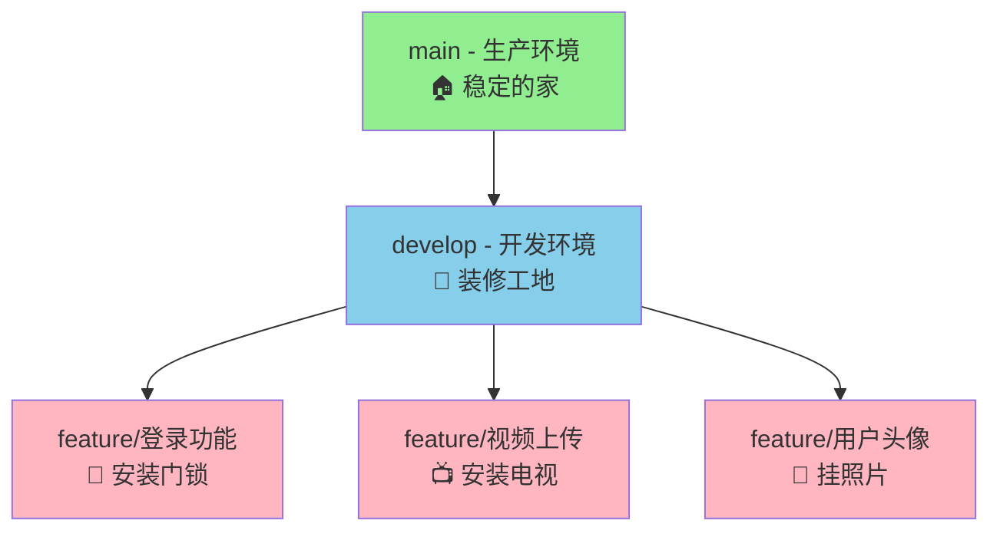

# Git 分支管理小白入门指南 🌱

> 欢迎来到 Git 世界！别担心，Git 其实没那么难。让我们用最简单的方式学会它。

## 📚 目录
1. [什么是 Git 分支？](#什么是-git-分支)
2. [为什么要用分支？](#为什么要用分支)
3. [我们的分支树](#我们的分支树)
4. [日常操作指南](#日常操作指南)
5. [常用命令速查](#常用命令速查)
6. [常见问题解决](#常见问题解决)
7. [实战练习](#实战练习)

---

## 🤔 什么是 Git 分支？

### 简单理解
想象你在写一本书：
- **主干（main）** = 正式出版的书（读者看到的）
- **分支** = 你的草稿本（自己随便改）

### 生活比喻
- **main** = 已经装修好的房子，可以住人
- **develop** = 正在装修的房子，工人在干活
- **feature分支** = 在某个房间试验新的装修方案

---

## 🎯 为什么要用分支？

### ❌ 不用分支的痛苦：
1. 改代码怕改坏，不敢随便试
2. 多人一起写代码会互相覆盖
3. 出错了很难恢复
4. 新功能没写完，老功能也用不了

### ✅ 用分支的好处：
1. **安全**：随便改，改坏了删掉分支就行
2. **团队协作**：各改各的，不互相影响
3. **版本清晰**：什么时候做了什么一目了然
4. **发布可控**：想什么时候发布就什么时候发布

---

## 🌳 我们的分支树



### 分支说明

| 分支名 | 状态 | 什么时候用 | 安全级别 |
|--------|------|------------|----------|
| **main** | 🟢 稳定 | 发布版本 | 🔒 极高安全 |
| **develop** | 🟡 开发中 | 日常开发 | 🔶 中等安全 |
| **feature/xxx** | 🔴 实验中 | 新功能开发 | 🔓 自由修改 |

---

## 📖 日常操作指南

### 🌅 每天开始工作

```bash
# 1. 切换到开发分支
git checkout develop

# 2. 拉取最新代码（别人可能更新了）
git pull origin develop

# 3. 查看当前状态
git status
```

### 🔨 开发新功能

**场景：要添加"用户头像上传"功能**

```bash
# 第1步：创建新分支
git checkout -b feature/user-avatar
# 现在你在 feature/user-avatar 分支上了！

# 第2步：开始写代码...
# 写代码、改文件、测试...

# 第3步：查看改了什么
git status

# 第4步：保存进度（提交）
git add .                    # 添加所有改动的文件
git commit -m "feat: 添加头像上传功能"  # 写清楚你做了什么

# 第5步：上传到GitHub
git push origin feature/user-avatar

# 第6步：去GitHub创建Pull Request
# 请求把你的代码合并到develop分支
```

### 🚑 紧急修复

**场景：网站突然崩溃了，需要立刻修复**

```bash
# 第1步：切换到主干（最新稳定版）
git checkout main

# 第2步：创建修复分支
git checkout -b hotfix/fix-website-crash

# 第3步：快速修复问题
# ...改代码...

# 第4步：提交修复
git add .
git commit -m "fix: 修复网站崩溃问题"

# 第5步：推送到GitHub
git push origin hotfix/fix-website-crash

# 第6步：合并到main（立即生效）
# 在GitHub上创建PR到main分支
```

### 🔄 代码写完了怎么办？

1. **在GitHub上创建Pull Request（PR）**
   - 进入你的项目页面
   - 点击"Compare & pull request"
   - 写清楚你做了什么修改

2. **等待审核**
   - 其他人会检查你的代码
   - 可能会有修改建议

3. **合并代码**
   - 审核通过后，合并到develop
   - 删除你的功能分支

---

## ⚡ 常用命令速查表

### 🏃‍♂️ 移动类
| 命令 | 作用 | 打比方 |
|------|------|--------|
| `git checkout develop` | 切换到develop分支 | 换到另一个房间工作 |
| `git checkout -b feature/新功能` | 创建并切换到新分支 | 开一个新的工作室 |
| `git pull origin develop` | 更新最新代码 | 同步别人做的改动 |
| `git push origin 分支名` | 推送代码到GitHub | 把你的作品上传分享 |

### 💾 保存类
| 命令 | 作用 | 打比方 |
|------|------|--------|
| `git status` | 查看当前状态 | 检查有哪些改动 |
| `git add .` | 添加所有改动 | 把所有文件放进打包箱 |
| `git commit -m "说明"` | 提交改动 | 贴上快递单，说明内容 |
| `git add 文件名` | 添加某个文件 | 把某个文件放进打包箱 |

### 📋 查看类
| 命令 | 作用 |
|------|------|
| `git branch` | 查看本地分支 |
| `git branch -a` | 查看所有分支（包括远程） |
| `git log --oneline -5` | 查看最近5次提交记录 |
| `git diff` | 查看具体改了什么内容 |

---

## ❓ 常见问题解决

### Q1: 出现冲突了怎么办？
**现象**：git pull 的时候报错，说有冲突

**解决方法**：
```bash
# 第1步：先别慌，保存你的进度
git add .
git commit -m "WIP: 暂存进度"

# 第2步：拉取最新代码
git pull origin develop

# 第3步：解决冲突（会有标记）
# 删除多余的内容，保留需要的
# 然后再次提交
git add .
git commit -m "解决冲突"
```

### Q2: 推送失败了？
**现象**：git push 的时候报错

**解决方法**：
```bash
# 可能是没拉取最新代码
git pull origin develop
# 然后再推送
git push origin 你的分支名
```

### Q3: 想撤销刚才的提交？
```bash
# 撤销上一次提交，但保留修改
git reset --soft HEAD~1

# 完全撤销（谨慎使用！）
git reset --hard HEAD~1
```

### Q4: 分支搞混了怎么办？
```bash
# 查看所有分支
git branch -a

# 查看当前在哪个分支
git branch

# 切换到正确分支
git checkout develop
```

---

## 🎮 实战练习

### 练习1：创建你的第一个功能分支

```bash
# 目标：创建一个"个人简介"功能
git checkout develop
git pull origin develop
git checkout -b feature/profile-page

# 创建一个新文件 profile.html
# 写一些简单的个人介绍

# 保存并提交
git add .
git commit -m "feat: 添加个人简介页面"
git push origin feature/profile-page
```

### 练习2：模拟紧急修复

```bash
# 场景：发现主页有个错别字
git checkout main
git checkout -b hotfix/fix-typo

# 修改错别字
git add .
git commit -m "fix: 修复主页错别字"
git push origin hotfix/fix-typo
```

### 练习3：查看项目历史

```bash
# 查看最近的提交记录
git log --oneline -10

# 查看某个文件的修改历史
git log -- 文件名

# 查看是谁在什么时候改的
git log --pretty=format:"%h - %an, %ar : %s"
```

---

## 💡 新手建议

### ✅ 推荐做的
1. **经常提交**：写一点就保存，别攒太多
2. **写清楚的说明**：让其他人能看懂你做了什么
3. **拉取最新代码**：每天开始工作前先更新
4. **问清楚再操作**：不确定就问，别乱试
5. **备份重要进度**：重要节点打个tag

### ❌ 避免做的
1. **不要直接在main上改代码**
2. **不要提交敏感信息**（密码等）
3. **不要推送大量无用的文件**
4. **不要强制推送**（除非你确定知道在做什么）
5. **不要删除别人还在用的分支**

---

## 📞 遇到问题怎么办？

1. **先冷静**：Git的问题一般都能解决
2. **查看状态**：`git status` 能提供很多信息
3. **查看历史**：`git log` 看看最近做了什么
4. **求助同事**：把错误信息截图给别人看
5. **查看文档**：本文档随时可以查阅

---

## 🎉 恭喜！

如果你看完了这个文档，恭喜你已经掌握了：
- ✅ Git分支的基本概念
- ✅ 日常工作的基本流程
- ✅ 常用命令的使用方法
- ✅ 基本的问题解决能力

**记住**：Git是工具，工具是为人服务的。别怕犯错，大胆尝试！

---

## 📚 更多资源

- [官方Git文档](https://git-scm.com/doc)
- [GitHub官方教程](https://docs.github.com/zh/get-started)
- [可视化Git学习](https://learngitbranching.js.org/)

**最后更新时间**：2025年10月21日

---

> 💡 **小贴士**：把这个文档收藏起来，遇到问题时随时翻阅！记住，每个Git高手都是从新手开始的。加油！🚀